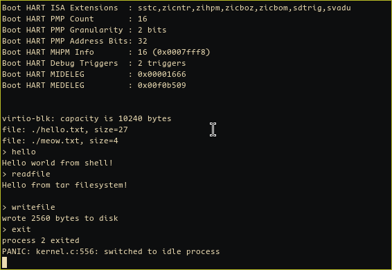

# 🖥️ Операционная система в 1000 строках кода на С

> Минимальная операционная система для архитектуры RISC-V 32-bit, реализованная по книге [Operating System in 1,000 Lines](https://operating-system-in-1000-lines.vercel.app/en/)



---

## 📋 Стек

- **Архитектура:** RISC-V 32-bit
- **Компилятор:** Clang с поддержкой RISC-V
- **Язык:** C11 (freestanding)
- **Виртуализация:** QEMU (для эмуляции)

---

## 🚀 О проекте

- **Минимальная операционная система** с полным набором базовых функций
- **Управление памятью** с поддержкой виртуальной адресации и страничной организации памяти (SV32)
  - Выделение страниц памяти
  - Маппинг виртуальных адресов на физические
  - Изоляция адресных пространств процессов
- **Многозадачность** с поддержкой до 8 процессов одновременно
  - Переключение контекста между процессами
  - Планировщик задач с round-robin алгоритмом
  - Изоляция процессов через отдельные page tables
- **Системные вызовы** для взаимодействия пользовательских программ с ядром
  - `SYS_PUTCHAR` — вывод символа в консоль
  - `SYS_GETCHAR` — чтение символа из консоли (с блокировкой)
  - `SYS_EXIT` — завершение процесса
  - `SYS_READFILE` — чтение файла
  - `SYS_WRITEFILE` — запись в файл
- **Файловая система** на основе формата tar (ustar)
  - Поддержка чтения и записи файлов
  - Автоматическая загрузка файлов из образа диска при старте
  - Сохранение изменений на диск через VirtIO
- **Работа с диском** через интерфейс VirtIO Block Device
  - Чтение и запись секторов диска
  - Поддержка виртуальных очередей VirtIO
- **Обработка исключений и прерываний** через trap handler
  - Обработка системных вызовов через инструкцию `ecall`
  - Переключение между режимами supervisor и user
- **Интерактивная оболочка (shell)** в пользовательском пространстве
  - Команда `hello` — приветствие
  - Команда `exit` — выход из shell
  - Команда `readfile` — чтение файла
  - Команда `writefile` — запись в файл
- **Разделение на kernel и user space**
  - Ядро работает в режиме supervisor
  - Пользовательские программы работают в режиме user с ограниченными правами
  - Защита памяти через page tables

---

## 📝 Структура проекта

```
OSIn1000Lines/
├── src/
│   ├── kernel.c      # Основной код ядра (управление процессами, системные вызовы)
│   ├── kernel.h      # Заголовочные файлы ядра
│   ├── kernel.ld     # Скрипт линковки ядра
│   ├── user.c        # Пользовательское пространство (системные вызовы)
│   ├── user.h        # Заголовочные файлы пользовательского пространства
│   ├── user.ld       # Скрипт линковки пользовательских программ
│   ├── shell.c       # Код интерактивной оболочки
│   ├── common.c      # Общие функции (printf, memset, memcpy, strcmp)
│   ├── common.h      # Общие определения
│   ├── Makefile      # Сборка проекта
│   ├── disk/         # Файлы для файловой системы
│   │   ├── hello.txt
│   │   └── meow.txt
│   └── run.sh        # Скрипт запуска в QEMU для Linux
│   └── run.bat        # Скрипт запуска в QEMU для Windows
└── README.md         # Этот файл
```

---

## 🎯 Сборка и запуск

### Требования

- **Clang** с поддержкой RISC-V target
- **LLVM objcopy** (llvm-objcopy)
- **QEMU** с поддержкой RISC-V 32-bit

### Запуск

```bash
cd src
./run.sh
```